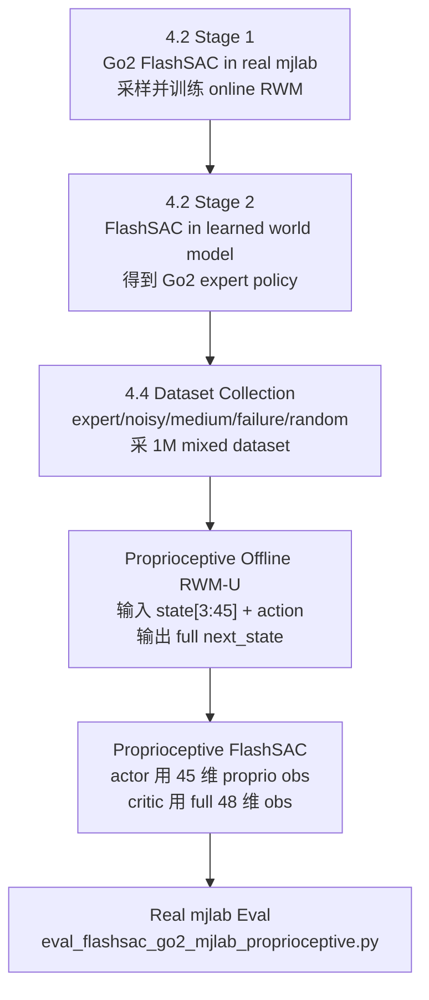

# Go2 FlashSAC + RWM-U + Proprioceptive Eval Pipeline

> 最终确认路线：先用 README 4.2 获取 Go2 expert policy，再用 README 4.4 的思路采集 1M mixed dataset。后半段不走 4.4 默认 full-observation SAC，而是切换到 proprioceptive world model 和 proprioceptive FlashSAC policy，最后用 `eval_flashsac_go2_mjlab_proprioceptive.py` 评估。

## 1. Pipeline 总览



如果师兄已经提供 Go2 expert policy checkpoint，可以跳过 README 4.2，直接从 4.4 dataset collection 开始。

## 2. 阶段总表

| 阶段 | 目标 | 关键脚本 | 输入 | 输出 |
|---|---|---|---|---|
| Step 0 | 准备环境和代码 | `uv sync` | `model_based` 分支 | 可运行的 mjlab/MuJoCo 环境 |
| Step 1 | 获取 Go2 expert policy | `train_pretrain_flashsac_go2.py` + `train_flashsac_world_model_go2.py` | 无或已有 4.2 checkpoint | `logs/model_based/go2_flat_flashsac_rwm_sacwm/<run>/step<step>/` |
| Step 2 | 采 1M mixed dataset | `run_mixed_safety_command_coverage_1m_offline_wm_sac_queue.sh` 中的 collect 阶段 | Go2 expert policy | `logs/rwm_datasets/go2_flat_mixed_safety_command_coverage_1m/dataset.pt` |
| Step 3 | 训练 proprioceptive world model | `train_world_model_offline_go2_proprioceptive.py` | `dataset.pt` | `model_5000.pt` / `latest.pt` |
| Step 4 | 训练 proprioceptive FlashSAC policy | `train_flashsac_world_model_go2_proprioceptive.py` | proprio WM + dataset | `logs/model_based/.../step<step>/actor.pt` |
| Step 5 | 回真实 mjlab 评估 | `eval_flashsac_go2_mjlab_proprioceptive.py` | proprio policy checkpoint | return、termination、velocity error 等指标 |

## 3. Step 0: 环境和仓库

仓库：

```text
origin: https://github.com/jaoyee/unitree_rl_mjlab.git
branch: model_based
local:  D:\whaleCpanDir\Desktop\RL\unitree_rl_mjlab
```

训练建议在服务器 GPU 容器中进行。本地主要用于看代码、改代码和同步结果。

安装方向：

```bash
uv python pin 3.10.18
uv sync
export WANDB_MODE=offline
export MUJOCO_GL=egl
```

## 4. Step 1: 获取 Go2 Expert Policy

4.4 需要一个 Go2 expert policy 来采集高质量 mixed dataset。这个 expert policy 不是 README 第 3 节的 G1 FlashSAC policy；G1 权重不能直接用于 Go2。

### 4.1 4.2 Stage 1: 在线采样并训练 World Model

脚本：

```text
scripts/reinforcement_learning/rwm_flashsac/train_pretrain_flashsac_go2.py
```

作用：

```text
真实 mjlab Go2 env 中运行 FlashSAC
一边采 transition
一边训练 RWM dynamics / world model
保存 world model、dataset 和 FlashSAC checkpoint
```

产物：

```text
logs/rsl_rl/go2_flat_rwm_flashsac_pretrain/<run>/
  model_<interaction_step>.pt
  dataset.pt
  step<interaction_step>/actor.pt
  step<interaction_step>/critic.pt
  step<interaction_step>/target_critic.pt
  step<interaction_step>/temperature.pt
```

### 4.2 4.2 Stage 2: 在 Learned World Model 中训练 Expert Policy

脚本：

```text
scripts/reinforcement_learning/rwm_flashsac/train_flashsac_world_model_go2.py
```

输入：

```text
logs/rsl_rl/go2_flat_rwm_flashsac_pretrain/<run>/model_<interaction_step>.pt
logs/rsl_rl/go2_flat_rwm_flashsac_pretrain/<run>/dataset.pt
```

输出：

```text
logs/model_based/go2_flat_flashsac_rwm_sacwm/<run>/step<step>/
  actor.pt
  critic.pt
  target_critic.pt
  temperature.pt
  agent_state.pt
  rwm_flashsac_config.yaml
```

这个 `step<step>` 目录就是后续 4.4 采数据用的 `EXPERT_POLICY_PATH`。

## 5. Step 2: 用 Expert Policy 采 1M Mixed Dataset

使用 README 4.4 的 dataset collection 思路。

脚本：

```text
scripts/reinforcement_learning/rwm_dataset/run_mixed_safety_command_coverage_1m_offline_wm_sac_queue.sh
```

4.4 里“从头运行”的含义是：从 4.4 自己的 dataset collection、offline WM、SAC 三阶段从头跑。它不表示从完全没有 expert policy 的状态开始。

默认配置中有：

```text
EXPERT_POLICY_PATH=logs/model_based/go2_flat_flashsac_rwm_sacwm/2026-06-05_17-27-59/step48828
COLLECTOR_MIX=expert:0.45,noisy_expert:0.25,medium:0.10,failure_border:0.15,random:0.05
```

采集分布：

| collector | 比例 | 含义 |
|---|---:|---|
| `expert` | 45% | 直接使用 expert policy action |
| `noisy_expert` | 25% | expert action 加小噪声 |
| `medium` | 10% | medium policy 或 expert 加更大噪声 |
| `failure_border` | 15% | expert action 加大噪声，制造接近失败的数据 |
| `random` | 5% | 完全随机 action |

正式输出：

```text
logs/rwm_datasets/go2_flat_mixed_safety_command_coverage_1m/dataset.pt
```

Smoke test 可以临时设置：

```bash
EXPERT_POLICY_PATH="" \
COLLECTOR_MIX=random:1.0 \
WANDB_MODE=offline CUDA_VISIBLE_DEVICES=0 \
bash scripts/reinforcement_learning/rwm_dataset/run_mixed_safety_command_coverage_1m_offline_wm_sac_queue.sh
```

这只能验证代码流程，不适合作为正式实验。

## 6. Step 3: 训练 Proprioceptive Offline RWM-U

最终评估使用 proprioceptive eval，因此 world model 训练也要使用 proprioceptive 版本。

脚本：

```text
scripts/reinforcement_learning/rwm_dataset/train_world_model_offline_go2_proprioceptive.py
```

配置：

```text
scripts/reinforcement_learning/rwm_dataset/configs/go2_offline_world_model_proprioceptive.yaml
```

输入：

```text
logs/rwm_datasets/go2_flat_mixed_safety_command_coverage_1m/dataset.pt
```

标准 world model 和 proprioceptive world model 的区别：

| 模型 | 输入 | 输出 | 目的 |
|---|---|---|---|
| standard RWM | full state 45 维 + action 12 维 | full next_state 45 维、contact、termination | 标准 learned dynamics |
| proprioceptive RWM | `state[..., 3:45]` 42 维 + action 12 维 | full next_state 45 维、contact、termination | 去掉 base linear velocity 输入，更接近实机 |

典型输出：

```text
logs/rsl_rl/go2_flat_rwm_offline_mixed_safety_command_coverage_1m_proprioceptive/<run>/
  model_5000.pt
  latest.pt
  final_metrics.json
  dataset_metadata.json
```

## 7. Step 4: 训练 Proprioceptive FlashSAC Policy

脚本：

```text
scripts/reinforcement_learning/rwm_flashsac/train_flashsac_world_model_go2_proprioceptive.py
```

配置：

```text
scripts/reinforcement_learning/rwm_flashsac/configs/go2_flashsac_rwm_proprioceptive_200k.yaml
```

输入：

```text
proprioceptive model_5000.pt
dataset.pt
```

这个脚本复用标准 FlashSAC world model trainer，但替换：

```text
1. dynamics loader 支持 proprioceptive dynamics checkpoint
2. agent 换成 create_go2_flashsac_proprioceptive_agent
```

策略观测：

| 网络 | 观测 | 维度 |
|---|---|---:|
| actor | `full_obs[:, 3:48]`，去掉 `base_lin_vel` | 45 |
| critic | full RWM observation | 48 |

输出：

```text
logs/model_based/go2_flat_flashsac_rwm_proprioceptive_1m/<run>/step<step>/
  actor.pt
  critic.pt
  target_critic.pt
  temperature.pt
  agent_state.pt
  rwm_flashsac_config.yaml
```

注意：不要把 4.4 默认 `train_flashsac_world_model_go2.py` 产出的 full-observation policy 直接拿去跑 proprioceptive eval。两者 actor 观测结构不同。

## 8. Step 5: Proprioceptive Eval

最终评估脚本：

```text
scripts/reinforcement_learning/rwm_flashsac/eval_flashsac_go2_mjlab_proprioceptive.py
```

输入：

```text
logs/model_based/go2_flat_flashsac_rwm_proprioceptive_1m/<run>/step<step>
```

典型命令：

```bash
WANDB_MODE=offline CUDA_VISIBLE_DEVICES=0 uv run python scripts/reinforcement_learning/rwm_flashsac/eval_flashsac_go2_mjlab_proprioceptive.py \
  --checkpoint_path logs/model_based/go2_flat_flashsac_rwm_proprioceptive_1m/<run>/step<step> \
  --num_envs 1024 \
  --steps 1001 \
  --device cuda:0 \
  --fixed_command 0.3 0.0 0.0 \
  --output_json logs/eval_go2_proprioceptive.json
```

重点指标：

| 指标 | 含义 |
|---|---|
| `mean_return` | 平均回报 |
| `mean_episode_length` | 平均 episode 长度 |
| `terminated_count` | 非 timeout 终止次数，越低越好 |
| `base_lin_vel_x` | 实际 x 方向速度 |
| `base_yaw_vel` | 实际 yaw 角速度 |
| `error_vel_xy` | 平面速度跟踪误差 |
| `error_vel_yaw` | yaw 跟踪误差 |
| `action_abs_mean` | action 幅值均值 |

不要只看 final checkpoint。需要对多个 `step<step>` 做 eval，选择真实 mjlab 表现最好的 checkpoint。

## 9. README 4.1 到 4.4 的定位

| README 小节 | 含义 | 当前路线中的作用 |
|---|---|---|
| 4.1 MOPO-PPO | PPO 在线采样 + PPO imagination training | 可用于理解或 smoke test，不是主线 |
| 4.2 MOPO-SAC | Go2 FlashSAC 在线采样 + FlashSAC imagination training | 用于产出 4.4 采数据所需的 Go2 expert policy |
| 4.3 200k offline WM + MOPO-SAC | 小规模 offline 路线 | 不是 4.4 的必要前置 |
| 4.4 1M mixed safety command coverage | 采 1M mixed dataset + offline WM + SAC | 当前复用其 dataset collection，后半段换成 proprioceptive 脚本 |

## 10. 关键检查点

正式跑之前逐项确认：

- Go2 expert policy 是否存在：

```text
logs/model_based/go2_flat_flashsac_rwm_sacwm/<run>/step<step>/
```

- expert policy 目录中是否有：

```text
actor.pt
critic.pt
target_critic.pt
temperature.pt
rwm_flashsac_config.yaml
```

- 4.4 dataset 是否已采集完成：

```text
logs/rwm_datasets/go2_flat_mixed_safety_command_coverage_1m/dataset.pt
```

- proprioceptive world model 是否训练完成：

```text
model_5000.pt 或 latest.pt
```

- proprioceptive SAC policy 是否训练完成：

```text
logs/model_based/.../step<step>/actor.pt
```

- 最终 eval 是否使用：

```text
scripts/reinforcement_learning/rwm_flashsac/eval_flashsac_go2_mjlab_proprioceptive.py
```

## 11. 最短执行路线

如果没有 expert policy：

```text
跑 4.2 产 Go2 expert policy
  -> 用 expert policy 跑 4.4 dataset collection
  -> 训练 proprioceptive offline RWM-U
  -> 训练 proprioceptive FlashSAC
  -> proprioceptive eval
```
如果已有 expert policy：

```text
直接跑 4.4 dataset collection
  -> 训练 proprioceptive offline RWM-U
  -> 训练 proprioceptive FlashSAC
  -> proprioceptive eval
```
